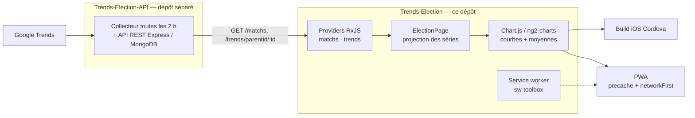

# Trends Election — application mobile

**Google peut-il prédire le résultat d'une élection présidentielle ?**
L'app confronte, pour chaque scrutin, l'intérêt de recherche Google des
candidats au résultat réel — l'hypothèse étant que le candidat le plus cherché
est celui qui est élu.

> Application mobile hybride Ionic 3 / Cordova (également servie en PWA) qui
> visualise les courbes de recherche Google de plusieurs candidats sur les 24 h
> et les 7 jours précédant une élection. Les données viennent de
> [tonylucas/Trends-Election-API](https://github.com/tonylucas/Trends-Election-API),
> le collecteur et l'API REST de ce projet.
>
> Projet de fin de **Master Développement Web** (ECV Digital, 2017), construit
> et déployé pendant la campagne présidentielle française de 2017.

## Le flux



Un **match** est une élection : un titre, un pays, une date de scrutin et la
liste de ses candidats. Pour chacun, l'API renvoie deux séries — la fenêtre
24 h et la fenêtre 7 jours — que l'app découpe en une courbe par candidat.

## Ce que le projet a demandé

| Compétence | Où le lire |
|---|---|
| **Application mobile hybride Ionic 3 / Cordova** : navigation par onglets, une élection par slide dans un carrousel `ion-slides`, bascule de fenêtre temporelle en `ion-segment`, build iOS | [`src/pages/tabs/`](src/pages/tabs/), [`src/pages/election/election.html`](src/pages/election/election.html), [`config.xml`](config.xml) |
| **Composition RxJS de requêtes dépendantes** : la liste des élections est chargée, puis chacune déclenche la récupération de ses séries, la vue ne se peuple qu'au fil des réponses | [`src/pages/election/election.ts`](src/pages/election/election.ts), [`src/providers/`](src/providers/) |
| **Transformation de données pour la dataviz** : le `timelineData` normalisé 0–100 de Google Trends est éclaté en un dataset Chart.js par candidat, plus une vue « moyennes » en barres, labels d'axe tronqués au jour + mois pour rester lisibles sur mobile | [`src/pages/election/election.ts`](src/pages/election/election.ts) |
| **Consommation d'API typée** : providers Angular injectables, modèles TypeScript avec héritage (`Parent` → `Keyword` / `Match`), endpoint sorti dans les `environments` | [`src/providers/`](src/providers/), [`src/models/`](src/models/) |
| **PWA et fonctionnement hors ligne** : service worker sw-toolbox, precache du bundle et du manifeste, `cacheFirst` sur les assets locaux et `networkFirst` par défaut | [`src/service-worker.js`](src/service-worker.js), [`src/manifest.json`](src/manifest.json) |
| **Lisibilité des graphiques** : palette Google à 5 couleurs partagée entre courbes, barres et pastilles de légende sous l'avatar de chaque candidat, points de courbe masqués et grille verticale retirée | [`src/pages/election/election.ts`](src/pages/election/election.ts), [`src/pages/election/election.scss`](src/pages/election/election.scss) |

**Périmètre, vérifiable dans le dépôt** — 34 fichiers sources sous
[`src/`](src/) ; 2 fenêtres temporelles par élection (24 h, 7 jours) ; jusqu'à
5 candidats par élection ; 2 modes de lecture par fenêtre (courbe d'intensité,
moyennes comparées) ; valeurs Google Trends normalisées 0–100.

## Stack

Ionic 3 · Angular 4 · RxJS 5 · TypeScript 2 · Chart.js 2 / ng2-charts ·
Cordova (iOS) · sw-toolbox

## Faire tourner

L'endpoint de production a été remplacé par un placeholder (`<api-host>`) avant
le passage en public. En développement l'app tape
`http://localhost:3000/`, soit une instance locale de
[Trends-Election-API](https://github.com/tonylucas/Trends-Election-API) — sans
elle, l'écran des élections reste vide.

```sh
npm install
ionic serve                       # navigateur, port 8100
ionic cordova run ios             # nécessite Xcode
```

`platforms/`, `plugins/` et `www/` ne sont plus suivis : ils sont régénérés par
`ionic cordova prepare` et `ionic build`.

## Limites, assumées

Dépôt **archivé en l'état de mai 2017**, gardé comme témoin de ce que je savais
faire à la sortie du master — pas maintenu, et les versions figées d'Ionic 3 et
de l'Angular CLI de l'époque ne s'installent plus sans friction sur un Node
récent.

- Pas de suite de tests.
- Deux onglets sur trois sont commentés dans
  [`src/pages/tabs/tabs.html`](src/pages/tabs/tabs.html) : « Candidats » et « Découvrir » n'ont
  jamais dépassé la page générée par le CLI.
- Le troisième mode de lecture, « par région », est une carte vide : la collecte
  `interestByRegion` n'a pas été branchée côté API.
- `ChartsComponent` est un composant généré resté inutilisé.
- Le code applicatif est en anglais, la documentation et les libellés en
  français.

## Dépôt lié

[**tonylucas/Trends-Election-API**](https://github.com/tonylucas/Trends-Election-API) —
le collecteur Google Trends, l'API REST et le back-office de composition des
élections.
